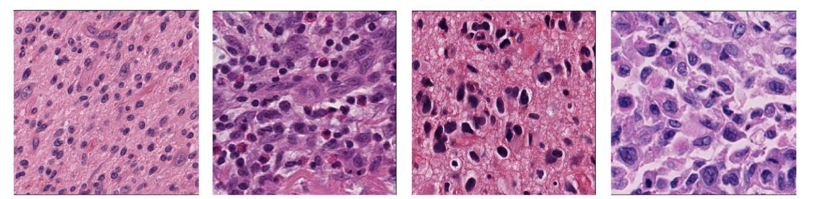

# Nuclei Instance Segmentation


[image source](https://ieeexplore.ieee.org/stamp/stamp.jsp?arnumber=8363604)

## Install
1. Install packages (ignore detectron2 error in this part)
2. Install detectron2
   ```shell
   # See your PyTorch version
   python3 -c "import torch; print(torch.__version__)"
   # See your Cuda version
   nvcc --version
   #
   ```
   Refer to: https://detectron2.readthedocs.io/en/latest/tutorials/install.html
   Find the instruction for installing dectectron2 based on your Cuda and PyTorch version.
   ```shell
   # E.g. if the Cuda version and the PyTorch version of current device is 11.1 and 1.10.0 respectively.
   # then you can:
   python3 -m pip install detectron2 -f https://dl.fbaipublicfiles.com/detectron2/wheels/cu111/torch1.10/index.html
   ```

## Prepare

1. [Download](https://drive.google.com/file/d/1nEJ7NTtHcCHNQqUXaoPk55VH3Uwh4QGG/view?usp=sharing) the dataset.zip (72
   MB), unzip it, and move it in the repo root path. The structure will be:
   ```text
   Nuclei-Instance-Segmentation/
   |___dataset/
       |___test/
       |   |___TCGA-50-5931-01Z-00-DX1.png
       |   |___TCGA-A7-A13E-01Z-00-DX1.png
       |       ...... (other 4 images, 6 test images in total)
       |___train/
       |   |___TCGA-18-5592-01Z-00-DX1 (first data's directory)
       |   |   |___images
       |   |   |   |___TCGA-18-5592-01Z-00-DX1.png (this data's image)
       |   |   |___masks
       |   |       |___mask_0001.png
       |   |       |___mask_0002.png
       |   |           ...... (all masks of instances)
       |   |___TCGA-21-5784-01Z-00-DX1 (second data's directory)
       |        ...... (other data, 24 in total)
       |___test_img_ids.json
   ...... (other dir)
   ```
2. Run `prepare.py` to automatically produce train/valid/test dataset.  
   Default: 24 train, 0 valid. If you want to change the number of valid images, modify the var in `prepare.py`.
   ```python
   # Default setting
   N_VALID = 0 # 0 valid
   MAX_IMG_ID = 23 # 24 data in total, 0 for valid, 24 for train, so the max img id is 23 (0~23)
   ```
   ```python
   # If you want 2 valid
   N_VALID = 2 # 0 valid
   MAX_IMG_ID = 21 # 24 data in total, 2 for valid, 22 for train, so the max img id is 21 (0~21)
   ```
   ```shell
   python3 prepare.py
   ```
3. Download my pretrained
   model: [link](https://drive.google.com/file/d/1to1K6_dnSVnY9-Qv3CJz_ITTaPqaxA1m/view?usp=sharing)  
   This was trained 37999 iteration from the pretrained model of cascade_mask_rcnn_R_50_FPN_3x on detectron2.
   ```shell
   pip3 install gdown
   gdown --id 1to1K6_dnSVnY9-Qv3CJz_ITTaPqaxA1m
   ```

4. Make augmentation data: follow the instruction of `make_augmentation_data.ipynb` and run all the cells. Augmentation
   data will be produced and saved in "aug/".

## Train

Train:

```shell
# 1. Modify the settings in main.py (e.g. from which pretrained model)
# 2. Run it.
python3 main.py
```

Track your training using Tensorboard:

```shell
# Default dir of training is "output/" 
tensorboard --logdir output
```

## Inference

Inference test images and make a submit file.
```shell
# You can modify the setting in inference.py
python3 inference.py
```

## Reference

- https://gilberttanner.com/blog/detectron2-train-a-instance-segmentation-model
- https://detectron2.readthedocs.io/en/latest/index.html
- https://github.com/072jiajia/CVDL_HW3
- https://github.com/joheras/CLoDSA
- https://www.immersivelimit.com/tutorials/create-coco-annotations-from-scratch
